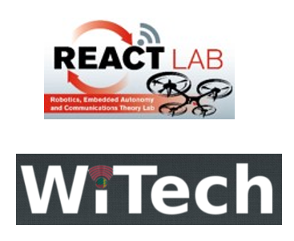
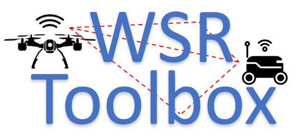
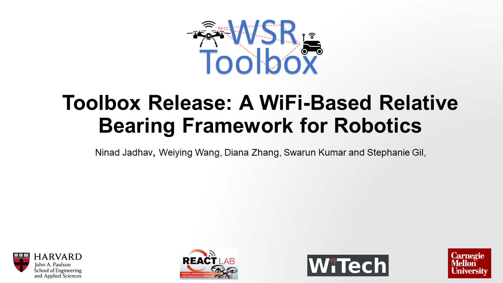
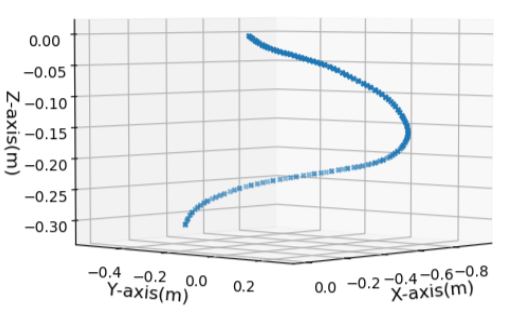
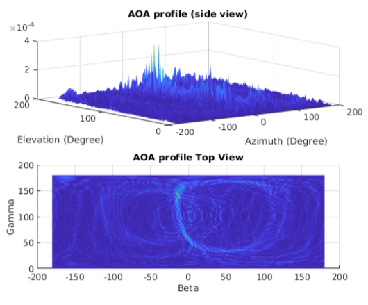
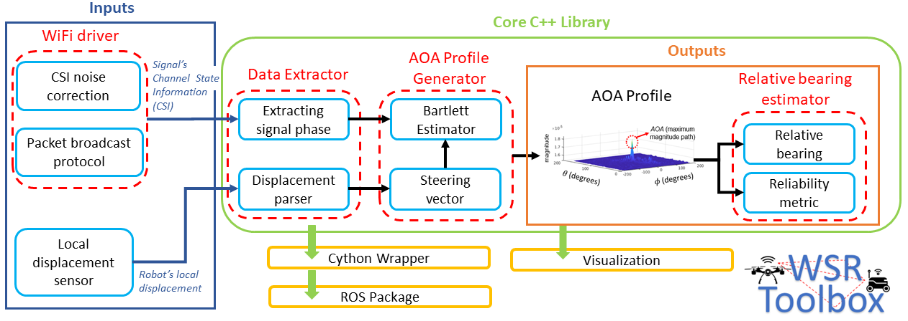

<div align="center">
  <a href="https://react.seas.harvard.edu//">
    
  </a>
  <a href="https://react.seas.harvard.edu/communication-sensor">
    
  </a>
  <a href="https://www.seas.harvard.edu/">
    
  </a>
</div>
<p>&nbsp;</p>

# WiFi-Based  Relative  Bearing  Sensor

WiFi-Sensor-for-Robotics (WSR) toolbox is an open source C++ framework. It is based on the theory akin to Synthetic Aperture Radar, developed in our prior works. It is motivated by the lack of easily deployable solutions that use robots' local resources (e.g WiFi) for sensing in NLOS It enables robots in a team to obtain information about each other, even in non-line-of-sight (NLOS) settings which is a very challenging problem in robotics. It does so by analyzing the phase of their communicated WiFi signals as the robots traverse the environment. Specifically, the toolbox allows robots to :-

* Obtain relative bearing to each other with implications to localization, rendezvous and mapping etc.
* Capture signal multipaths (i.e signal reflections and attenuations in the environment) in a *profile* with implications to maintaining communication quality in adhoc mobile robot networks or using the profiles as figerprints for spoof-resilience in robot networks.     

The toolbox is designed for distributed and online deployment on robot platforms using commodity hardware and on-board sensors. **In depth details are available on the [Wiki Page](https://github.com/Harvard-REACT/WSR-Toolbox/wiki)**.



<!-- ### AOA profile obtained using 3D robot motion
<div align="center">
  
  
  
</div>
<p>&nbsp;</p> -->

## Input Sensor Requirements

The toolbox requires following inputs
1. Channel State Information (CSI) for both signal transmitting and receiving robots collected using a WiFi card. Supported WiFi Cards for CSI data collection:<br />
- [x] Intel 5300 WiFi card ([Linux 802.11n CSI Tool](http://dhalperi.github.io/linux-80211n-csitool/))
- [ ] Broadcom WiFi cards ([Nexmon CSI](https://github.com/seemoo-lab/nexmon_csi))
- [ ] Qualcom WiFI cards ([Atheros CSI Toolbox](https://wands.sg/research/wifi/AtherosCSI/))

Please refer the *Collecting CSI from WiFi cards* section of the [wiki](https://github.com/Harvard-REACT/WSR-Toolbox/wiki) complete installation details for a specific WiFi card.

2. Local displacement of the signal receiving robot. Supported sensors for collecting robot displacement data:<br />
Any local inertial sensor can be used as long as the input is provided in csv file in the following format (minimum requirement):
```
{sec,nsec,x,y,z,qx,qy,qz,qw}
``` 
where sec and nsec refer the local timestamp in seconds and nanoseconds respectively; {x,y,z} are the estimated position coordinates form the sensor. Please refer the *Collecting robot displacement* section of the [wiki](https://github.com/Harvard-REACT/WSR-Toolbox/wiki) for additional details.

## Architecture



The technical specifications of the toolbox components can be found in the wiki page [here](https://github.com/Harvard-REACT/WSR-Toolbox/wiki/System-Architecture)

## Code repositories
1. The core library: [WSR-Toolbox-cpp](https://github.com/Harvard-REACT/WSR-Toolbox-cpp). 
2. Intel 5300 modified wifi driver and firmware : [WSR-WifiDriver](https://github.com/Harvard-REACT/WSR-WifiDriver)
3. Supplementary tool: [WSR-Toolbox-linux-80211n-csitool-supplementary](https://github.com/Harvard-REACT/WSR-Toolbox-linux-80211n-csitool-supplementary)

The Core library repository is the toolbox its readme has the required steps which give installation and dependency details. The WiFi driver and Supplementary tool repositories enable CSI data collection using intel 5300 WiFi card.

## Datasets
We release the [WSR-Toolbox-Dataset](https://github.com/Harvard-REACT/WSR-Toolbox-Dataset) demonstrating its performance in NLOS and line-of-sight (LOS) settings for a multi-robot localization usecase. Empirical results show that the bearing estimation from our toolbox achieves mean accuracy of 5.10 degrees. This leads to a median error of 0.5m and 0.9m for localization in LOS and NLOS settings respectively, in a hardware deployment in an indoor office environment. Additioanl results for hardware experiements are available in *experiments section* of the [wiki](https://github.com/Harvard-REACT/WSR-Toolbox/wiki#experiment-results).  


## Citation
- [1] Ninad Jadhav, Weiying Wang, Diana Zhang, Swarun Kumar and Stephanie Gil. [**Toolbox  Release:  A  WiFi-Based  Relative  Bearing  Framework  for  Robotics**](https://arxiv.org/abs/2109.12205).
 
 ```bibtex
@article{Jadhav_WSR_toolbox,
  title={Toolbox  Release:  A  WiFi-Based  Relative  Bearing  Sensor  for  Robotics},
  author={Ninad Jadhav and Weiying Wang and Diana Zhang and Swarun Kumar and Stephanie Gil},
  conference={IEEE/RSJ International Conference on Intelligent Robots and Systems},
  year={2022}
}
```

- [2] Ninad Jadhav*, Weiying Wang*, Diana Zhang, O. Khatib, Swarun Kumar and Stephanie Gil. [**A Wireless Signal-Based Sensing
Framework for Robotics**](https://arxiv.org/abs/2012.04174) (* denotes co-primary authors)

```bibtex
@article{JadhavWangWSR,
  title={A wireless signal-based sensing framework for robotics},
  author={Ninad Jadhav and Weiying Wang and Diana Zhang and O. Khatib and Swarun Kumar and Stephanie Gil},
  journal={International Journal of Robotics Research},
  year={2022},
  volume={}
}
```

## Acknowledgments
We gratefully acknowledge funding support through Lincoln Labs Line grant, Sloan Research Fellowship 2021 (FG-2020-13998), National Science Foundation CAREER Award [CNS-2114733] and grants (1718435, 1837607, 2106921, 2030154 and 2007786) and partial support through ONR YIP grant (N00014-21-1-2714). Experiments were conducted in the REACT Lab at Harvard University and Arizona State University.

## License
[BSD License](LICENSE.BSD)
