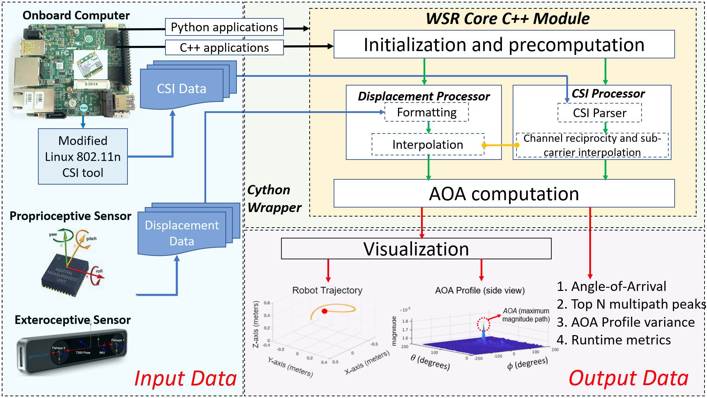
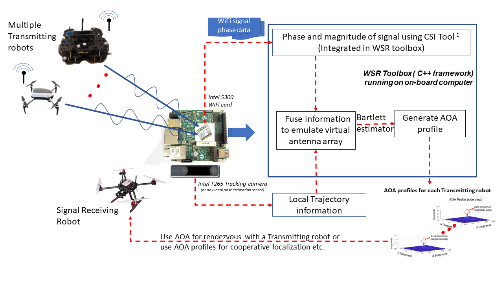

<div align="center">
  <a href="https://react.seas.harvard.edu//">
    
  </a>
  <a href="https://react.seas.harvard.edu/communication-sensor">
    
  </a>
  <a href="https://www.seas.harvard.edu/">
    
  </a>
</div>
<p>&nbsp;</p>

# WiFi-Based  Relative  Bearing  Sensor

WiFi-Sensor-for-Robotics (WSR) toolbox is an open source library, that enables robots in a team to obtain relative bearing to each other by analyzing the phase of their communicated wireless signals as they traverse the environment. Importantly, this capability can be used in non-line-of-sight (NLOS) or visually degraded environements to recover relative spatial positioning information between robots with implications for localization, networking and security amongst others. This toolbox is designed for distributed deployment and real-time operation on robotic platforms using commodity hardware.


<!-- ### AOA profile obtained using 3D robot motion
<div align="center">
  
  
  
</div>
<p>&nbsp;</p> -->

The toolbox requires following inputs
1. Channel State Information (CSI) for both signal transmitting and receiving robots collected using a WiFi card.
2. Local displacement of the signal receiving robot. 

Additional details can be found in the [Wiki page](https://github.com/Harvard-REACT/WSR-Toolbox/wiki/Documentation)

### Toolbox Architecture



The technical specifications of the toolbox components can be found in the wiki page [here](https://github.com/Harvard-REACT/WSR-Toolbox/wiki/System-Architecture)

## Hardware and software requirement
1. Supported WiFi Cards for CSI data collection
- [x] Intel 5300 WiFi card ([Linux 802.11n CSI Tool](http://dhalperi.github.io/linux-80211n-csitool/))
- [ ] Broadcom WiFi cards ([Nexmon CSI](https://github.com/seemoo-lab/nexmon_csi))

Please refer the *Collecting CSI from WiFi cards* section of the [wiki](https://github.com/Harvard-REACT/WSR-Toolbox/wiki/Documentation) for detail specific to a WiFi card.

2. Supported sensors for collecting robot displacement data 
Any local inertial sensor can be used as long as the input is provided in csv file in the following format (minimum requirement):
```
{sec,nsec,x,y,z,qx,qy,qz,qw}
``` 
where sec and nsec refer the local timestamp in seconds and nanoseconds respectively; {x,y,z} are the estimated position coordinates form the sensor.

### Code repositories (will be accessible after publication):
1. The core C++ library: [WSR-Toolbox-cpp](https://github.com/Harvard-REACT/WSR-Toolbox-cpp). 
2. Intel 5300 modified wifi driver and firmware : [WSR-WifiDriver](https://github.com/Harvard-REACT/WSR-WifiDriver)
3. Supplementary tool: [WSR-Toolbox-linux-80211n-csitool-supplementary](https://github.com/Harvard-REACT/WSR-Toolbox-linux-80211n-csitool-supplementary)

The wifidriver and supplementary tool repositories are a modified version of code released as part [Linux 802.11n CSI Tool](http://dhalperi.github.io/linux-80211n-csitool/). A detailed explanation of design decision behind the modifications (i.e support for channel reprocity, handling packet collision) can be found in the publication [**Toolbox  Release:  A  WiFi-Based  Relative  Bearing  Sensor  for  Robotics**]()


### Workflow diagram for using with multiple robots




## Datasets
These dataset are collected for indoor environments in LOS and NLOS for different robot trajectories
1. [WSR-Toolbox-Dataset](https://github.com/Harvard-REACT/WSR-Toolbox-Dataset)


## Citation
- [1] Jadhav Ninad*, Weiying Wang*, Diana Zhang, O. Khatib, Swarun Kumar and Stephanie Gil. [**WSR: A WiFi Sensor for Collaborative Robotics**](https://arxiv.org/abs/2012.04174) (* denotes co-primary authors)

```bibtex
@article{Jadhav2020WSRAW,
  title={WSR: A WiFi Sensor for Collaborative Robotics},
  author={Ninad Jadhav and Weiying Wang and Diana Zhang and O. Khatib and Swarun Kumar and Stephanie Gil},
  journal={ArXiv},
  year={2020},
  volume={abs/2012.04174}
}
```

- [2] Jadhav Ninad, Weiying Wang, Diana Zhang, Swarun Kumar and Stephanie Gil. [**Toolbox  Release:  A  WiFi-Based  Relative  Bearing  Sensor  for  Robotics**]().
 
 ```bibtex
@article{WSR_toolbox,
  title={Toolbox  Release:  A  WiFi-Based  Relative  Bearing  Sensor  for  Robotics},
  author={Ninad Jadhav and Weiying Wang and Diana Zhang and Swarun Kumar and Stephanie Gil},
  journal={},
  year={},
  volume={}
}
```

## Acknowledgments
We  gratefully  acknowledge  funding  support  through  the NSF and MIT Lincoln Laboratories. Experiments were conducted in the the REACT Lab.

## License

[BSD License](LICENSE.BSD)